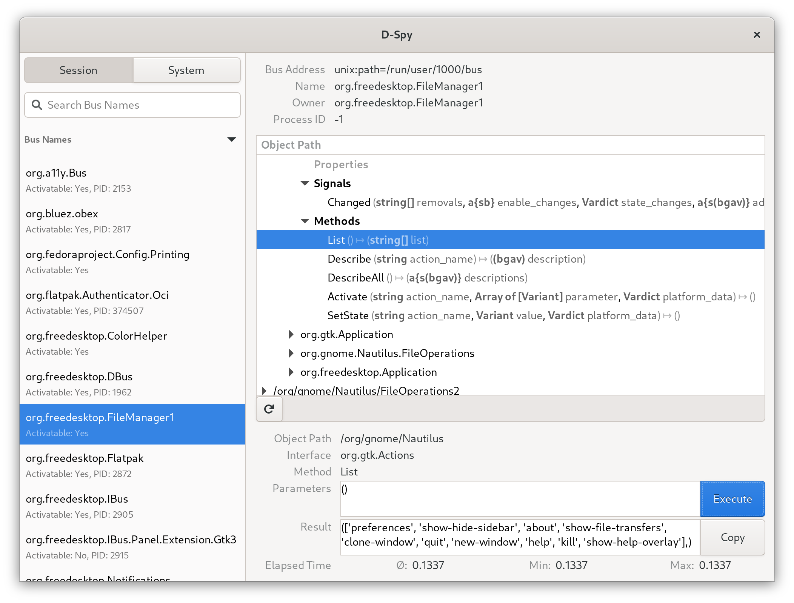

# D-Spy

A simple tool to explore [D-Bus](https://dbus.freedesktop.org/doc/dbus-specification.html) connections.



## Installation

### Flathub

https://flathub.org/apps/org.gnome.dspy

```
flatpak install flathub org.gnome.dspy
flatpak run org.gnome.dspy
```

## Building from source

### Using Flatpak

```shell
flatpak --user remote-add --if-not-exists gnome-nightly https://nightly.gnome.org/gnome-nightly.flatpakrepo
flatpak-builder --user --install-deps-from=gnome-nightly --repo=repo --install build/ org.gnome.dspy.devel.json
```

### Using GNOME Builder

```
git clone https://gitlab.gnome.org/GNOME/d-spy
flatpak run org.gnome.Builder -p ./d-spy/
```

Then click Run.

## Feature Requests and Design Changes

D-spy uses its GitLab issue tracker primarily for engineering defects. For new features or significant design changes:

1.  **Initiate Discussion:** Start by discussing your idea or proposal through the [GNOME Design Whiteboards project](https://gitlab.gnome.org/Teams/Design/whiteboards/).
2.  **Develop a Specification:** For larger features, a detailed specification is required. This should cover:
    *   How the feature should work and not work.
    *   Interaction with existing features.
    *   Any necessary migration strategies.
    *   UI mock-ups (if applicable).
    *   Testing strategy.
    *   Potential risks and security considerations.
    *   Ideally, an indication of who might implement it.

Once a design is well-defined, an issue can be filed on the D-spy tracker referencing the design discussion/specification.
